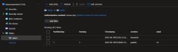

# DATOS Y ALMACEN

**Storage: Proporciona servicios de almacenamiento de archivos y objetos.**

### Cuenta de Almacenamiento de Azure

- **Modelo de servicio:** IaaS.
- **Caracteristicas:** Seguridad, alta, disponibilidad, durabilidad y escalabilidad.

La cuenta de almacenamiento de es la que contiene todos los objetos de los demas servicios.

-----------------------------------------------------------------------------------

### Pasos para crear un Table Storage    

1.- Abrir el [Portal Azure](portal.azure.com).

2.- Nos iremos a la parte de almacenamiento y nos vamos a la seccion Tablas.

2.- Crearemos una tabla.

4.- Para editar una tabla nos vamos a Explorador de almacenamiento (version preliminar).

5.- Buscamos nuestra tabla y le damos en "agregar entidad", donde podremos agregar una entidad.

**Estas tablas sirven para agregar informacion rapido, sin necesidad de usar algo complejo**

6.- Ahora agregaremos otra entidad, a lo que ya nos pedira que ingresemos un nombre, se lo agregamos y ahora pondremos otra entidad pero de diferente tipo.

7.- Debemos poner antes de ingresar la nueva entidad 1  y 1, para que se cree en otra fila.

8.- Listo esto es un Table storage

-----------------------------------------------------------------------------------------------------------------------
